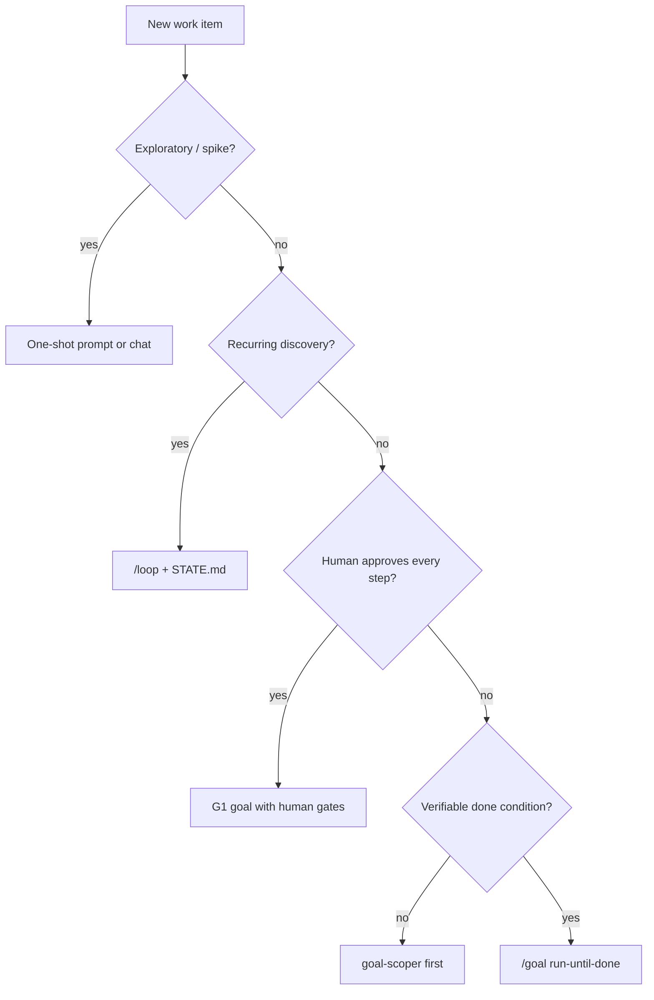

# When Not to Use Goals

Goals are for **bounded, verifiable finish work**. Use this decision guide before `/goal`.

## Do not use a goal when…

### Exploratory spikes

You do not know what "done" looks like yet. Use a normal prompt; capture learnings in a doc, not `GOAL.md`.

### Open-ended research

"Understand the codebase" has no objective gate. Use chat or a time-boxed loop, not a goal.

### Every step needs design approval

Use **G1 assisted** goals with explicit human checkpoints — or skip autonomy and pair program.

### Work is inherently recurring

Security scans, inbox triage, dependency bumps on cadence → [loop-engineering](https://github.com/cobusgreyling/loop-engineering).

### Done condition cannot be checked

Subjective goals ("make it nicer") fail verifiers. Run `goal-scoper` to add `npm test`, coverage %, or grep gates.

### Parallel goals on the same files

Pause one goal or serialize. See [multi-goal.md](multi-goal.md).

## Use a goal when…

- CI is red and you want green with proof
- One module migration with import-scan gate
- Bug with repro + regression test
- Scoped feature with acceptance criteria
- Refactor with full test lock

## Quick matrix

| Work type | Recommendation |
|-----------|----------------|
| Spike / prototype | Prompt |
| Daily triage | Loop |
| Finish one ticket | Goal |
| 5 related tickets | 5 sequential goals |
| "Fix everything" | goal-scoper → split |

Next: [pattern-picker.md](pattern-picker.md) · [golden path](../examples/golden-path/SESSION.md)